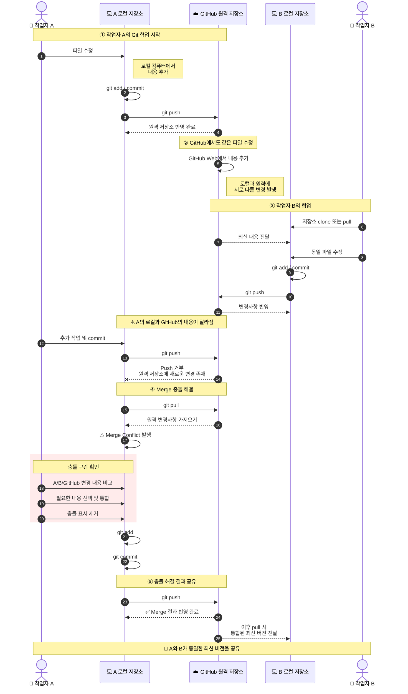

# 2026 Git Start
로컬 컴퓨터에서 추가한 내용입니다.

# 2026-git-start
오늘의 학습 목표 : GitHub와 로컬 저장소의 Merge 충돌 해결 실습

GitHub 웹에서 추가한 내용입니다.


오늘의 학습 목표: 작업자 B의 Merge 충돌 실습

오늘의 학습 목표: 작업자 A의 Git 협업 실습

# Git 협업 및 Merge 충돌 해결 실습

## 전체 흐름



## 핵심 과정 요약

**로컬 수정 → Commit → Push → 다른 작업자의 수정 → 원격 변경 발생 → Pull → Merge Conflict → 충돌 해결 → Commit → Push**

```text
┌─────────────┐
│  작업자 수정 │
└──────┬──────┘
       ↓
┌─────────────┐
│ add / commit │
└──────┬──────┘
       ↓
┌─────────────┐
│    push      │
└──────┬──────┘
       ↓
┌──────────────────┐
│ 다른 위치에서 수정 │
│ GitHub / 작업자 B │
└────────┬─────────┘
         ↓
┌─────────────┐
│    pull      │
└──────┬──────┘
       ↓
    ⚠️ 충돌
       ↓
┌─────────────┐
│ 충돌 내용 확인 │
│   및 수정     │
└──────┬──────┘
       ↓
┌─────────────┐
│ add / commit │
└──────┬──────┘
       ↓
┌─────────────┐
│    push      │
└──────┬──────┘
       ↓
   ✅ 협업 완료
```

> **실습의 핵심**
>
> Git 협업 중 여러 작업자가 같은 파일을 수정하면 로컬 저장소와 원격 저장소의 변경 내용이 달라질 수 있다. 이때 원격 변경사항을 `pull`하고, 발생한 Merge Conflict를 직접 해결한 뒤 다시 `commit`과 `push`하여 하나의 최종 버전으로 통합한다.
